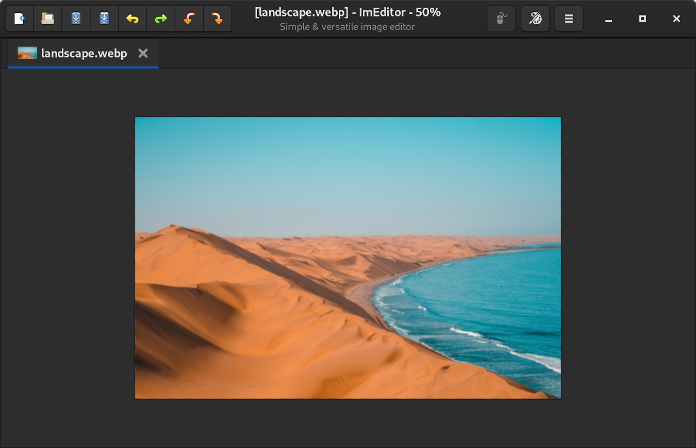

# ImEditor

## Simple & versatile image editor.

### Functionalities

- Tabs
- Create or open an image
- Drawing capacities
- Apply filters on an image
- History feature
- Copy/paste/cut features
- Selection feature
- Few basic operations (rotate, image details,…)

### Supported formats

PNG, JPEG, WEBP, BMP, ICO

### Supported modes

RGB, RGBA

## Screenshot

## Installation instructions

### Universal package for Linux (recommended)

For now, ImEditor is available on the Snap Store:

    sudo snap install imeditor
    
This snap package will be replaced by a flatpak package soon.

## Tech

ImEditor uses a number of open source projects to work properly:

- [GTK 3](https://www.gtk.org)
- [Python 3](https://www.python.org)
- [Pillow](https://python-pillow.org)

## License

GNU GENERAL PUBLIC LICENSE (v3)

**Free Software, Hell Yeah!**
